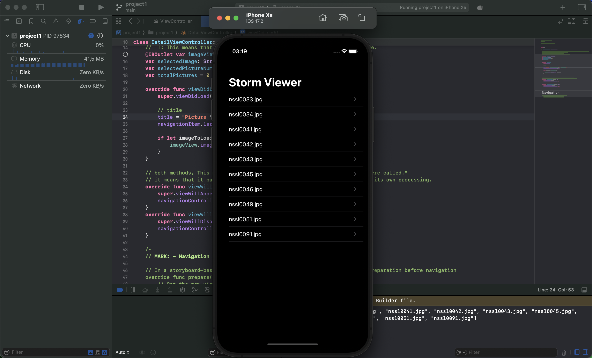

# UIKit

# Challenge:

This has the beginnings of a useful app, but if you really want your new knowledge to sink in you need to start writing some new code yourself – without following a tutorial, or having an answer you can just look up online.

So, each time you complete a project I’ll be setting you a challenge to modify it somehow. Yes, this will take some work, but there is no learning without struggle – all the challenges are completely within your grasp based on what you’ve learned so far.

For this project, your challenges are:

Use Interface Builder to select the text label inside your table view cell and adjust its font size to something larger – experiment and see what looks good.
In your main table view, show the image names in sorted order, so “nssl0033.jpg” comes before “nssl0034.jpg”.
Rather than show image names in the detail title bar, show “Picture X of Y”, where Y is the total number of images and X is the selected picture’s position in the array. Make sure you count from 1 rather than 0.

## Use Interface Builder to select the text label inside your table view cell and adjust its font size to something larger – experiment and see what looks good.
## In your main table view, show the image names in sorted order, so “nssl0033.jpg” comes before “nssl0034.jpg”.

## Rather than show image names in the detail title bar, show “Picture X of Y”, where Y is the total number of images and X is the selected picture’s position in the array. Make sure you count from 1 rather than 0.

